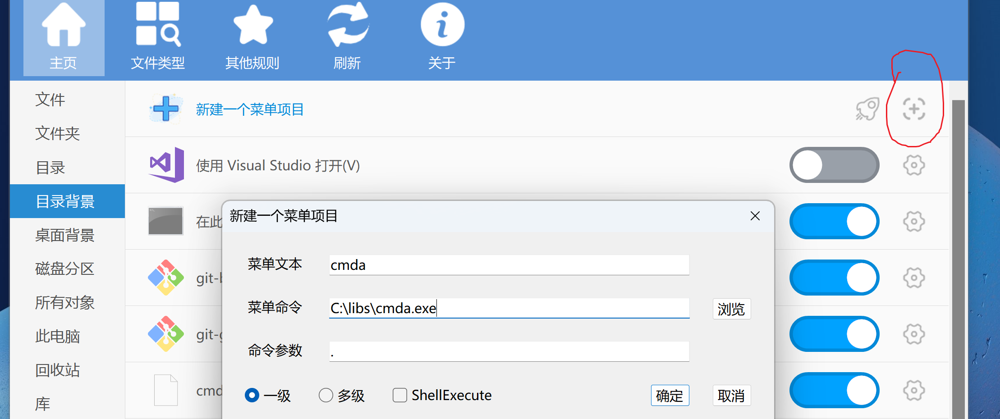

# cmda

使用管理员权限打开cmd.exe/Open cmd.exe with administrator privileges

# 原理

1 以“管理员身份运行” cmda.exe，cmda 打开 cmd.exe 继承管理员权限
2 cmda 只是一个简单的“代理工具/中介”
3 你也可以使用 python/bat 脚本作为中介打开 cmd，继承管理员权限。
4 cmda 可以作为可执行文件添加到右键菜单，打开cmd后定位到当前目录

# 使用步骤

1. 把 cmda.exe 复制到任意目录，比如 `C:\libs`，该目录最好添加进 PATH。

```
"C:\libs\cmda.exe"
```

2. 设置 cmda.exe 属性
	1 右键菜单
	2 兼容性
	3 **管理员身份运行此程序**


3. 

```
cd C:\Users\github

cmda .
// 1 提示获取管理员权限
// 2 打开一个有管理员权限的cmd窗口
// 3 新窗口定位到 C:\Users\github
```

# 添加 cmda 到右键菜单

1. 软件 ContextMenuManager.NET.4.0.exe

github.com/BluePointLilac/ContextMenuManager/releases
releases 可下载 exe


2. 主页 》 目录背景 》新建一个菜单项目
	1 菜单文本: cmda .
	2 菜单命令: C:\libs\cmda.exe 
		必须完整路径
	3 命令参数: .



3. 预览


# todo

使 cmda 打开的是 WindowsTerminal.exe，而不是传统 cmd.exe。
